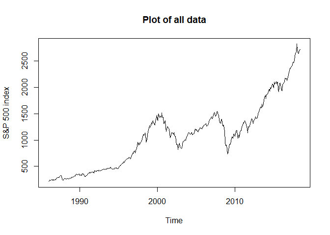
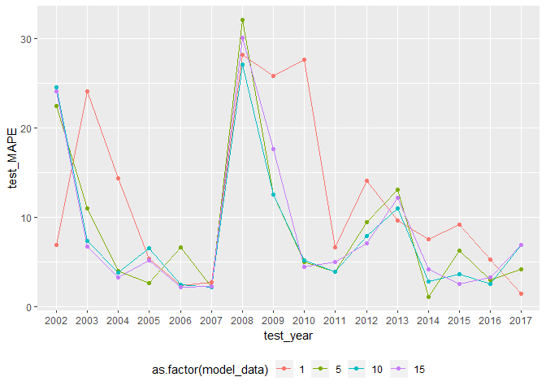
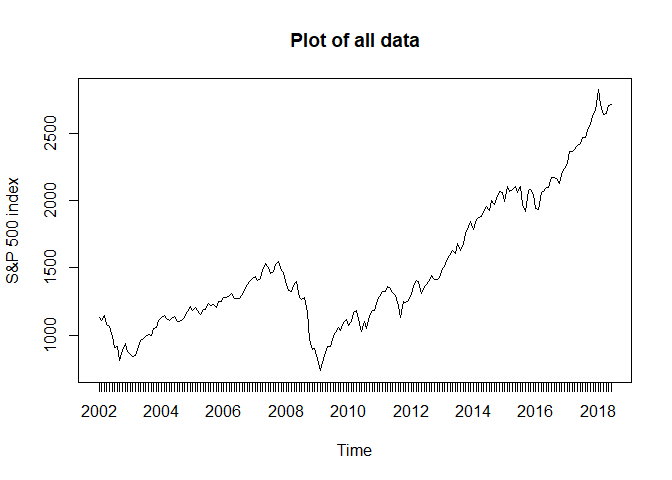

ARIMA model of S&P500
================

Check the relationship between the number of observations in training data and prediction accuracy. Fix ARIMA (1,1,1) model. Try different test data period.

Setup
=====

``` r
library(forecast) # Rob Hyndman time series analysis package
library(xts)
library(ggplot2)
```

Data
====

``` r
sp_df <- read.csv("spx.csv", head = T)
dates <- as.Date(sp_df$date, format = "%d-%b-%y")
sp_xts <- xts(x = sp_df$close, order.by = dates)
colnames(sp_xts) <- "close"
head(sp_xts)
```

    ##             close
    ## 1986-01-02 209.59
    ## 1986-01-03 210.88
    ## 1986-01-06 210.65
    ## 1986-01-07 213.80
    ## 1986-01-08 207.97
    ## 1986-01-09 206.11

``` r
tail(sp_xts)
```

    ##              close
    ## 2018-06-22 2754.88
    ## 2018-06-25 2717.07
    ## 2018-06-26 2723.06
    ## 2018-06-27 2699.63
    ## 2018-06-28 2716.31
    ## 2018-06-29 2718.37

``` r
sp_m <- to.monthly(sp_xts)
head(sp_m)
```

    ##          sp_xts.Open sp_xts.High sp_xts.Low sp_xts.Close
    ## Jan 1986      209.59      213.80     203.49       211.78
    ## Feb 1986      213.96      226.92     212.79       226.92
    ## Mar 1986      225.42      238.97     224.34       238.90
    ## Apr 1986      235.14      244.74     228.63       235.52
    ## May 1986      235.16      247.98     232.76       247.35
    ## Jun 1986      245.04      250.84     239.58       250.84

``` r
tail(sp_m)
```

    ##          sp_xts.Open sp_xts.High sp_xts.Low sp_xts.Close
    ## Jan 2018     2695.81     2872.87    2695.81      2823.81
    ## Feb 2018     2821.98     2821.98    2581.00      2713.83
    ## Mar 2018     2677.67     2786.57    2588.26      2640.87
    ## Apr 2018     2581.88     2708.64    2581.88      2648.05
    ## May 2018     2654.80     2733.29    2629.73      2705.27
    ## Jun 2018     2734.62     2786.85    2699.63      2718.37

``` r
plot.zoo(sp_m$sp_xts.Close,
         main = "Plot of all data",
         xlab = "Time",
         ylab = "S&P 500 index")
```



Modeling
========

``` r
years <- seq(2016, 2001, -1)
n_test <- length(years)

results_01y <- matrix(NA, n_test, 4)
results_05y <- matrix(NA, n_test, 4)
results_10y <- matrix(NA, n_test, 4)
results_15y <- matrix(NA, n_test, 4)

results_01y[,1] <- years+1
results_05y[,1] <- years+1
results_10y[,1] <- years+1
results_15y[,1] <- years+1
results_01y[,2] <- rep(1, n_test)
results_05y[,2] <- rep(5, n_test)
results_10y[,2] <- rep(10, n_test)
results_15y[,2] <- rep(15, n_test)
colnames(results_01y) <- c("test_year", "model_data", "train_MAPE", "test_MAPE")
colnames(results_05y) <- c("test_year", "model_data", "train_MAPE", "test_MAPE")
colnames(results_10y) <- c("test_year", "model_data", "train_MAPE", "test_MAPE")
colnames(results_15y) <- c("test_year", "model_data", "train_MAPE", "test_MAPE")

for (i in 1:n_test) {

  # Make index to extract data
  train_01y_index <- paste(years[i], "01/", years[i], "12", sep = "")
  train_05y_index <- paste(years[i]-4, "01/", years[i], "12", sep = "")
  train_10y_index <- paste(years[i]-9, "01/", years[i], "12", sep = "")
  train_15y_index <- paste(years[i]-14, "01/", years[i], "12", sep = "")
  test_index      <- paste(years[i]+1, "01/", years[i]+1, "12", sep = "")

  # train test split
  train_01y <- sp_m$sp_xts.Close[train_01y_index]
  train_05y <- sp_m$sp_xts.Close[train_05y_index]
  train_10y <- sp_m$sp_xts.Close[train_10y_index]
  train_15y <- sp_m$sp_xts.Close[train_15y_index]
  test      <- sp_m$sp_xts.Close[test_index]  

  # ARIMA model
  model_01y <- Arima(ts(train_01y), order=c(1,1,1), 
                     lambda=0, include.drift=TRUE)
  model_05y <- Arima(ts(train_05y), order=c(1,1,1), 
                     lambda=0, include.drift=TRUE)
  model_10y <- Arima(ts(train_10y), order=c(1,1,1), 
                     lambda=0, include.drift=TRUE)
  model_15y <- Arima(ts(train_15y), order=c(1,1,1), 
                     lambda=0, include.drift=TRUE)
  
  # Predict
  fc_01y <- forecast::forecast(model_01y, h = 12)
  fc_05y <- forecast::forecast(model_05y, h = 12)
  fc_10y <- forecast::forecast(model_10y, h = 12)
  fc_15y <- forecast::forecast(model_15y, h = 12)

  # Calculate MAPE
  acc01 <- accuracy(fc_01y, test)[,5]
  acc05 <- accuracy(fc_05y, test)[,5]
  acc10 <- accuracy(fc_10y, test)[,5]
  acc15 <- accuracy(fc_15y, test)[,5]
  
  # Save results
  results_01y[i, 3:4] <- acc01
  results_05y[i, 3:4] <- acc05
  results_10y[i, 3:4] <- acc10
  results_15y[i, 3:4] <- acc15

}
```

Check prediction accuracy
=========================

``` r
results <- data.frame(rbind(results_01y, results_05y, results_10y, results_15y))
ggplot(results) +
  geom_line(aes(x = test_year, y = test_MAPE, col = as.factor(model_data))) +
  geom_point(aes(x = test_year, y = test_MAPE, col = as.factor(model_data))) + 
  theme(legend.position = "bottom") +
  scale_x_discrete(limits=years+1)
```




