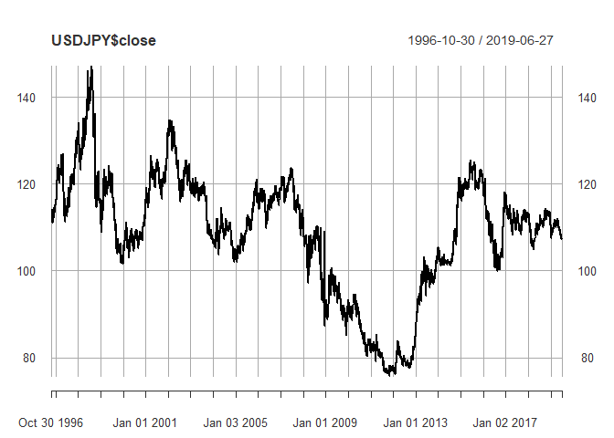

EDA USD/JPY
================

Package
=======

``` r
library(quantmod)
library(TTR)
library(zoo)
# library(plotly)
```

Data
====

``` r
# The oldest date is 1996-10-30
getSymbols(
  "JPY=X", 
  src = "yahoo",
  from = "1996-10-30"
)
```

    ## 'getSymbols' currently uses auto.assign=TRUE by default, but will
    ## use auto.assign=FALSE in 0.5-0. You will still be able to use
    ## 'loadSymbols' to automatically load data. getOption("getSymbols.env")
    ## and getOption("getSymbols.auto.assign") will still be checked for
    ## alternate defaults.
    ## 
    ## This message is shown once per session and may be disabled by setting 
    ## options("getSymbols.warning4.0"=FALSE). See ?getSymbols for details.

    ## Warning: JPY=X contains missing values. Some functions will not work if
    ## objects contain missing values in the middle of the series. Consider using
    ## na.omit(), na.approx(), na.fill(), etc to remove or replace them.

    ## [1] "JPY=X"

``` r
USDJPY <- `JPY=X`
colnames(USDJPY) <- c("open", "high", "low", "close", "volume", "adjusted")

class(USDJPY)
```

    ## [1] "xts" "zoo"

``` r
dim(USDJPY)
```

    ## [1] 5913    6

``` r
head(USDJPY)
```

    ##              open   high    low  close volume adjusted
    ## 1996-10-30 114.37 114.48 113.61 114.18      0   114.18
    ## 1996-10-31     NA     NA     NA     NA     NA       NA
    ## 1996-11-01 113.50 113.50 113.50 113.50      0   113.50
    ## 1996-11-04 113.28 113.98 112.95 113.88      0   113.88
    ## 1996-11-05 113.71 114.33 113.45 114.25      0   114.25
    ## 1996-11-06 114.23 114.68 113.65 113.95      0   113.95

``` r
tail(USDJPY)
```

    ##               open    high     low   close volume adjusted
    ## 2019-06-20 107.295 107.723 107.046 107.277      0  107.277
    ## 2019-06-23 107.320 107.515 107.251 107.312      0  107.312
    ## 2019-06-24 107.349 107.404 106.783 107.327      0  107.327
    ## 2019-06-25 107.183 107.750 107.164 107.166      0  107.166
    ## 2019-06-26 107.734 108.153 107.654 107.738      0  107.738
    ## 2019-06-27 107.772 107.848 107.564 107.747      0  107.747

``` r
apply(apply(USDJPY, 2, is.na), 2, sum)
```

    ##     open     high      low    close   volume adjusted 
    ##       43       43       43       43       43       43

Imputing NA
===========

``` r
USDJPY <- na.locf(
  USDJPY,
  na.rm = TRUE,
  fromLast = FALSE,
  maxgap = Inf
)
head(USDJPY)
```

    ##              open   high    low  close volume adjusted
    ## 1996-10-30 114.37 114.48 113.61 114.18      0   114.18
    ## 1996-10-31 114.37 114.48 113.61 114.18      0   114.18
    ## 1996-11-01 113.50 113.50 113.50 113.50      0   113.50
    ## 1996-11-04 113.28 113.98 112.95 113.88      0   113.88
    ## 1996-11-05 113.71 114.33 113.45 114.25      0   114.25
    ## 1996-11-06 114.23 114.68 113.65 113.95      0   113.95

``` r
apply(apply(USDJPY, 2, is.na), 2, sum)
```

    ##     open     high      low    close   volume adjusted 
    ##        0        0        0        0        0        0

EAD
===

``` r
plot(USDJPY$close)
```



Candle chart is not like this. Something strange...
