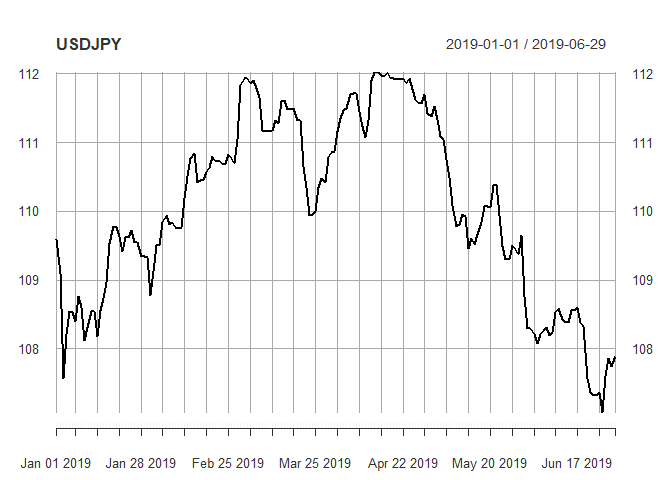

EDA USD/JPY
================

Package
=======

``` r
library(quantmod)
```

    ## Warning: package 'quantmod' was built under R version 3.5.3

    ## Loading required package: xts

    ## Warning: package 'xts' was built under R version 3.5.2

    ## Loading required package: zoo

    ## Warning: package 'zoo' was built under R version 3.5.3

    ## 
    ## Attaching package: 'zoo'

    ## The following objects are masked from 'package:base':
    ## 
    ##     as.Date, as.Date.numeric

    ## Loading required package: TTR

    ## Warning: package 'TTR' was built under R version 3.5.3

    ## Version 0.4-0 included new data defaults. See ?getSymbols.

Data
====

``` r
getFX("USD/JPY",
      from = "2019-01-01")
```

    ## [1] "USD/JPY"

``` r
class(USDJPY)
```

    ## [1] "xts" "zoo"

``` r
dim(USDJPY)
```

    ## [1] 180   1

``` r
head(USDJPY)
```

    ##             USD.JPY
    ## 2019-01-01 109.5973
    ## 2019-01-02 109.0931
    ## 2019-01-03 107.5644
    ## 2019-01-04 108.2092
    ## 2019-01-05 108.5370
    ## 2019-01-06 108.5330

``` r
tail(USDJPY)
```

    ##             USD.JPY
    ## 2019-06-24 107.3620
    ## 2019-06-25 107.0781
    ## 2019-06-26 107.6012
    ## 2019-06-27 107.8646
    ## 2019-06-28 107.7475
    ## 2019-06-29 107.8960

EAD
===

``` r
plot(USDJPY)
```


