GARCH model of S&P500
================

Apply GARCH model for S&P500 daily return to estimate return volatility.

Package
=======

``` r
suppressMessages(library(PerformanceAnalytics))
suppressMessages(library(rugarch))
suppressMessages(library(xts))
suppressMessages(library(moments)) # jarque.test function
suppressMessages(library(QRM))
suppressMessages(library(astsa)) # acf2 function
```

Data
====

``` r
sp_df <- read.csv("spx.csv", head = T)
dates <- as.Date(sp_df$date, format = "%d-%b-%y")
sp_xts <- xts(x = sp_df$close,
              order.by = dates)
colnames(sp_xts) <- "close"
head(sp_xts)
```

    ##             close
    ## 1986-01-02 209.59
    ## 1986-01-03 210.88
    ## 1986-01-06 210.65
    ## 1986-01-07 213.80
    ## 1986-01-08 207.97
    ## 1986-01-09 206.11

``` r
plot(sp_xts)
```

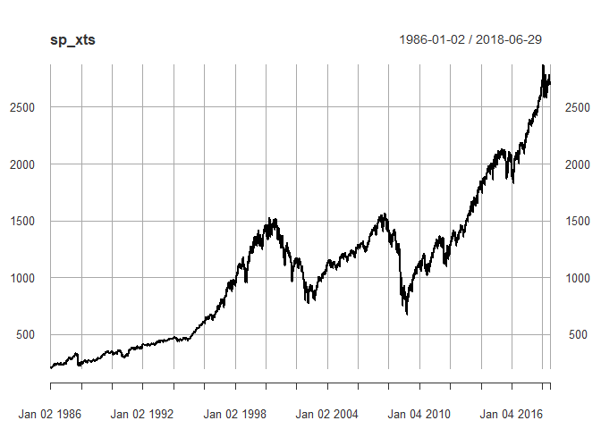

Transformation
==============

``` r
sp <- CalculateReturns(sp_xts)[-1]
head(sp)
```

    ##                    close
    ## 1986-01-03  0.0061548738
    ## 1986-01-06 -0.0010906677
    ## 1986-01-07  0.0149537147
    ## 1986-01-08 -0.0272684752
    ## 1986-01-09 -0.0089435976
    ## 1986-01-10 -0.0007277667

EDA
===

``` r
plot(sp)
```

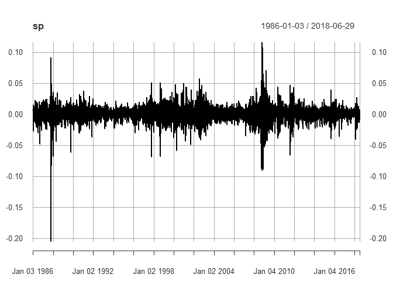

``` r
hist(sp, nclass = 50)
```

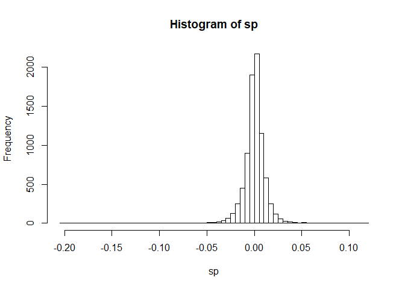

``` r
sp_num <- sort(as.numeric(sp))
mu <- mean(sp_num)
sigma <- sd(sp_num)
skew <- skewness(sp_num)
kurt <- kurtosis(sp_num)
round(c(mu, sigma, skew, kurt), 3)
```

    ## [1]  0.000  0.011 -0.838 21.351

Negative skew and heavy tail.

Fit the normal distribution
===========================

``` r
chart.Histogram(
  sp,
  methods = c("add.density", "add.normal"),
  colorset = c("gray", "red", "blue")
)
```

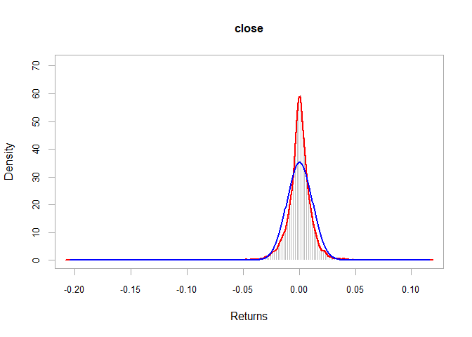

``` r
chart.Histogram(
  sp,
  methods = c("add.density", "add.normal"),
  colorset = c("gray", "red", "blue"),
  ylim = c(0, 1)
)
```

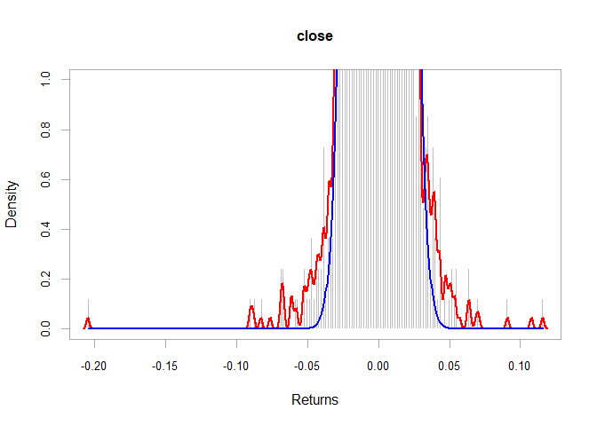

``` r
qqnorm(sp)
qqline(sp)
```

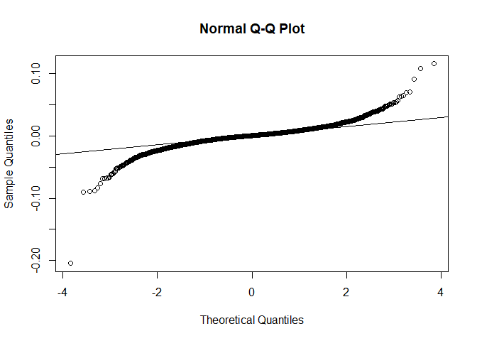

Inverse S shape means heavy tail distribution.

``` r
jarque.test(as.numeric(sp))
```

    ## 
    ##  Jarque-Bera Normality Test
    ## 
    ## data:  as.numeric(sp)
    ## JB = 156620, p-value < 2.2e-16
    ## alternative hypothesis: greater

It rejects the null hypothesis that the distribution is normal.

Fit the Student t distribution
==============================

``` r
tfit <- fit.st(as.numeric(sp))
tpars <- tfit$par.ests
tpars
```

    ##           nu           mu        sigma 
    ## 2.7971081747 0.0006400525 0.0066878207

``` r
nu_t <- tpars[1]
mu_t <- tpars[2]
sigma_t <- tpars[3]
```

``` r
sp_num <- sort(as.numeric(sp))
tval <- dt((sp_num - mu_t)/sigma_t, df = nu_t)/sigma_t

hist(sp_num, nclass = 100, probability = TRUE)
lines(sp_num, dnorm(sp_num, mean = mu, sd = sigma), col = "red")
lines(sp_num, tval, col = "blue")
```

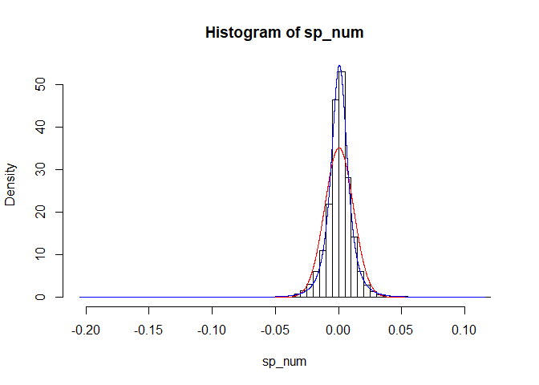

``` r
hist(sp_num, nclass = 100, probability = TRUE, ylim = c(0, 0.5))
lines(sp_num, dnorm(sp_num, mean = mu, sd = sigma), col = "red")
lines(sp_num, tval, col = "blue")
```

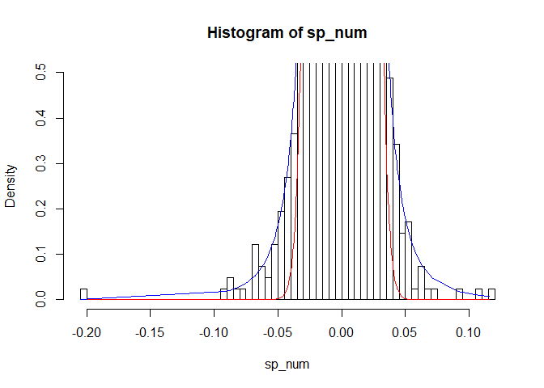

The Student t distribution fits the data better than the normal distribution.

Autocorrelation
===============

``` r
acf <- acf2(sp)
```

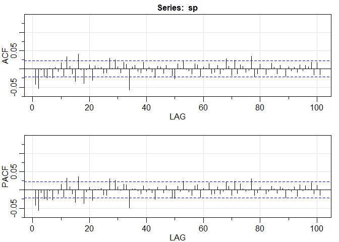

``` r
acf <- acf2(abs(sp))
```

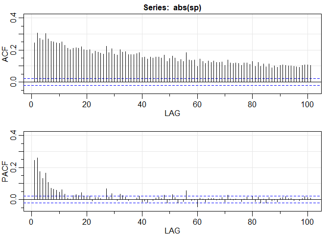

Ljung-Box test
==============

``` r
Box.test(sp, lag = 10, type = "Ljung")
```

    ## 
    ##  Box-Ljung test
    ## 
    ## data:  sp
    ## X-squared = 54.118, df = 10, p-value = 4.612e-08

``` r
Box.test(abs(sp), lag = 10, type = "Ljung")
```

    ## 
    ##  Box-Ljung test
    ## 
    ## data:  abs(sp)
    ## X-squared = 5799.2, df = 10, p-value < 2.2e-16

It rejects the null hypothesis that the data is iid.

Rolling volatility estimation
=============================

22 = monthly trading days, 252 = yearly trading days.

``` r
# Compute daily standard deviation
sd(sp)
```

    ## [1] 0.01132539

``` r
# Compute annualized standard deviation
sqrt(252) * sd(sp)
```

    ## [1] 0.179785

``` r
chart.RollingPerformance(
  R = sp,
  width = 22,
  FUN = "sd.annualized",
  scale = 252,
  main = "Rolling 1 month volatility"
)
```

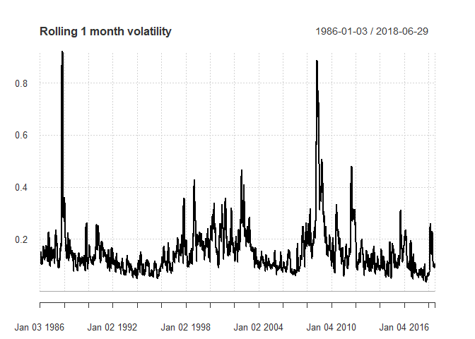

GARCH Model
===========

``` r
# GARCH (1,1) model with constant mean
garchspec <- ugarchspec(mean.model = list(armaOrder = c(0,0)),
                        variance.model = list(model = "sGARCH"),
                        distribution.model = "norm")

# Estimate GARCH model
garchfit <- ugarchfit(data = sp,
                      spec = garchspec)

# coefficients
garchcoef <- coef(garchfit)

# Unconditional variance
garchuncvar <- uncvariance(garchfit)

# Predicted mean
garchmean <- fitted(garchfit)

# Predicted volatilities
garchvol <- sigma(garchfit)
```

``` r
print(garchcoef)
```

    ##           mu        omega       alpha1        beta1 
    ## 6.294217e-04 1.678606e-06 9.627891e-02 8.910213e-01

``` r
round(garchfit@fit$matcoef, 6)
```

    ##         Estimate  Std. Error   t value Pr(>|t|)
    ## mu      0.000629    0.000087  7.201441 0.000000
    ## omega   0.000002    0.000001  2.425701 0.015279
    ## alpha1  0.096279    0.009678  9.948625 0.000000
    ## beta1   0.891021    0.010170 87.609998 0.000000

``` r
sqrt(garchuncvar)
```

    ## [1] 0.01149679

``` r
garchvol <- sigma(garchfit)
plot(garchvol)
```

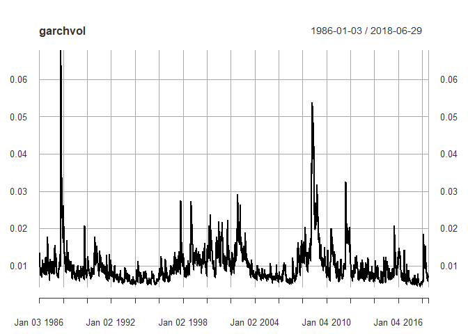

Forecasting future volatilities
===============================

``` r
# Forecast the volatility of the future returns
garchforecast <- ugarchforecast(fitORspec = garchfit,
                                n.ahead = 5)
sigma(garchforecast)
```

    ##      2018-06-29
    ## T+1 0.006919057
    ## T+2 0.006995997
    ## T+3 0.007071139
    ## T+4 0.007144551
    ## T+5 0.007216298

GARCH model with skewed student t
=================================

The data shows the negative skewness, heavy tail, and fit with the Student t distribution.

``` r
garchspec_sstd <- ugarchspec(
  mean.model = list(armaOrder = c(0, 0)),
  variance.model = list(model = "sGARCH"),
  distribution.model = "sstd"
)

garchfit_sstd <- ugarchfit(
  data = sp,
  spec = garchspec_sstd
)
```

``` r
coef(garchfit_sstd)
```

    ##           mu        omega       alpha1        beta1         skew 
    ## 5.879462e-04 8.115389e-07 7.752144e-02 9.182846e-01 9.423024e-01 
    ##        shape 
    ## 5.909764e+00

``` r
round(garchfit_sstd@fit$matcoef, 6)
```

    ##         Estimate  Std. Error    t value Pr(>|t|)
    ## mu      0.000588    0.000085   6.933584 0.000000
    ## omega   0.000001    0.000000   3.032226 0.002428
    ## alpha1  0.077521    0.005004  15.492435 0.000000
    ## beta1   0.918285    0.004708 195.036519 0.000000
    ## skew    0.942302    0.013675  68.908926 0.000000
    ## shape   5.909764    0.375951  15.719489 0.000000

GJR GARCH model
===============

For the negative skewness in the data.

``` r
garchspec_gjr <- ugarchspec(
  mean.model = list(armaOrder = c(0, 0)),
  variance.model = list(model = "gjrGARCH"),
  distribution.model = "sstd"
)

garchfit_gjr <- ugarchfit(
  data = sp,
  spec = garchspec_gjr
)
```

``` r
round(garchfit_gjr@fit$matcoef, 6)
```

    ##         Estimate  Std. Error   t value Pr(>|t|)
    ## mu      0.000372    0.000083  4.479782 0.000007
    ## omega   0.000001    0.000002  0.673779 0.500452
    ## alpha1  0.010117    0.009272  1.091034 0.275258
    ## beta1   0.905826    0.032107 28.212652 0.000000
    ## gamma1  0.145161    0.043747  3.318188 0.000906
    ## skew    0.923061    0.012474 73.999782 0.000000
    ## shape   6.387264    0.645781  9.890763 0.000000

``` r
coef(garchfit_gjr)[2:5]
```

    ##        omega       alpha1        beta1       gamma1 
    ## 1.447599e-06 1.011660e-02 9.058264e-01 1.451608e-01

``` r
round(coef(garchfit_gjr)[2:5], 3)
```

    ##  omega alpha1  beta1 gamma1 
    ##  0.000  0.010  0.906  0.145

$\\hat{\\sigma\_t^2}=$
1.4 \* 10<sup>−6</sup> + 0.16*e*<sub>*t* − 1</sub><sup>2</sup> + 0.91*σ*<sub>*t* − 1</sub><sup>2</sup> for *e*<sub>*t* − 1</sub> ≤ 0.
1.4 \* 10<sup>−6</sup> + 0.01*e*<sub>*t* − 1</sub><sup>2</sup> + 0.91*σ*<sub>*t* − 1</sub><sup>2</sup> for *e*<sub>*t* − 1</sub> &gt; 0.

``` r
out <- newsimpact(garchfit_gjr)
plot(out$zx, out$zy, xlab = "prediction error", ylab = "predicted variance", type = "l")
```

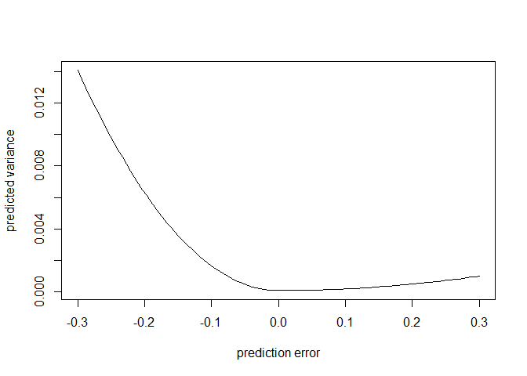
