GARCH model of Tokyo Electric Power Company
================

Apply GARCH model to Tokyo Electric Power Company (TEPCO).

Package
=======

``` r
# library(RFinanceYJ)
library(quantmod)
library(rugarch)
library(PerformanceAnalytics)
library(moments)
library(QRM)
```

Data
====

``` r
# Fail (RFinanceYJ)
# tepco <- quoteStockXtsData("9984")

# Success (quantmod)
# 1951-08-24: Date listed on Tokyo Stock Exchange from Wiki
# getSymbols("9501",
#            src = "yahooj",
#            from = "1951-08-24", 
#            to = "2019-05-31")
# saveRDS(YJ9501, "YJ9501_19830104_20190531.rds")

tepco <- readRDS("YJ9501_19830104_20190531.rds")
class(tepco)
```

    ## [1] "xts" "zoo"

``` r
head(tepco)
```

    ##            YJ9501.Open YJ9501.High YJ9501.Low YJ9501.Close YJ9501.Volume
    ## 1983-01-04         980         989        976          980        885400
    ## 1983-01-05         989         990        981          985       1091100
    ## 1983-01-06         990        1070        985         1050       7665101
    ## 1983-01-07        1060        1070       1040         1050       7147301
    ## 1983-01-08        1060        1080       1050         1070       4588801
    ## 1983-01-10        1070        1070       1040         1050       2034200
    ##            YJ9501.Adjusted
    ## 1983-01-04          941.85
    ## 1983-01-05          946.66
    ## 1983-01-06         1009.13
    ## 1983-01-07         1009.13
    ## 1983-01-08         1028.35
    ## 1983-01-10         1009.13

``` r
tail(tepco)
```

    ##            YJ9501.Open YJ9501.High YJ9501.Low YJ9501.Close YJ9501.Volume
    ## 2019-05-24         603         608        598          598       5979900
    ## 2019-05-27         598         607        598          606       3576000
    ## 2019-05-28         606         609        597          601      11195900
    ## 2019-05-29         585         589        575          582       7807000
    ## 2019-05-30         574         580        570          570       6320900
    ## 2019-05-31         565         565        553          558       8947600
    ##            YJ9501.Adjusted
    ## 2019-05-24             598
    ## 2019-05-27             606
    ## 2019-05-28             601
    ## 2019-05-29             582
    ## 2019-05-30             570
    ## 2019-05-31             558

EDA
===

``` r
plot.zoo(tepco$YJ9501.Close)
```

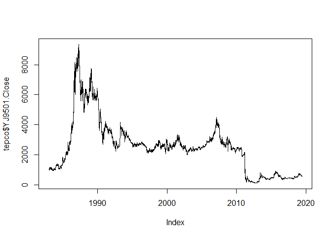

``` r
tepco_rt <- CalculateReturns(tepco$YJ9501.Close)[-1]
```

``` r
plot(tepco_rt)
```

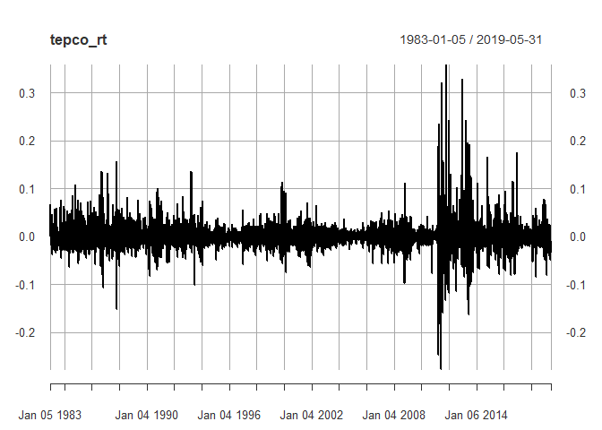

Rolling volatility estimation
=============================

22 = monthly trading days. 252 = yearly trading days.

``` r
chart.RollingPerformance(
  R = tepco_rt,
  width = 22,
  FUN = "sd.annualized",
  scale = 252,
  main = "Rolling 1 month volatility"
)
```

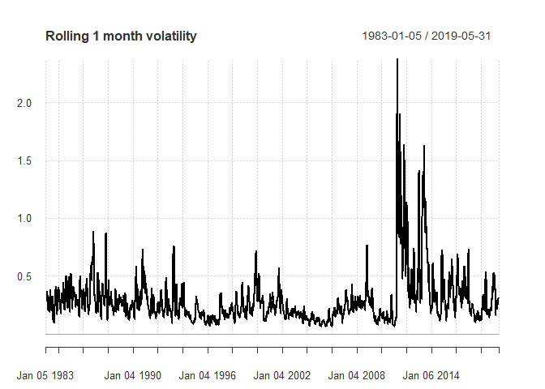

``` r
hist(tepco_rt, nclass = 100, probability = TRUE)
```

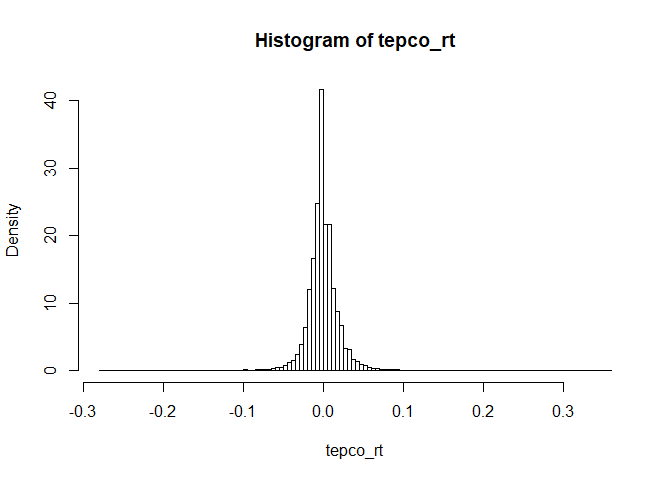

Testing for normality
=====================

``` r
tepco_rt_num <- sort(as.numeric(tepco_rt))
mu <- mean(tepco_rt_num)
sigma <- sd(tepco_rt_num)
skew <- skewness(tepco_rt_num)
kurt <- kurtosis(tepco_rt_num)
round(c(mu, sigma, skew, kurt), 3)
```

    ## [1]  0.000  0.024  1.481 32.188

Positive skew and heavy tail.

``` r
hist(tepco_rt_num, nclass = 100, probability = TRUE)
lines(tepco_rt_num, dnorm(tepco_rt_num, mean = mu, sd = sigma), col = "red")
```

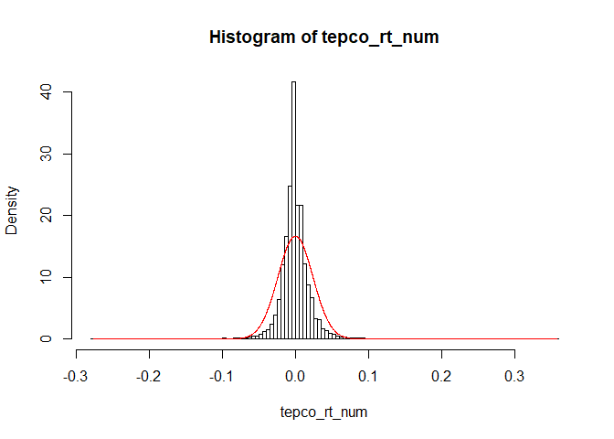

``` r
qqnorm(tepco_rt_num)
qqline(tepco_rt_num)
```

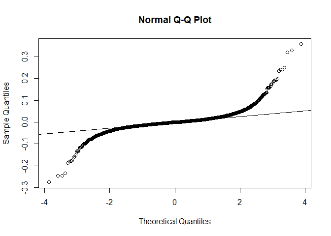

``` r
jarque.test(tepco_rt_num)
```

    ## 
    ##  Jarque-Bera Normality Test
    ## 
    ## data:  tepco_rt_num
    ## JB = 398930, p-value < 2.2e-16
    ## alternative hypothesis: greater

It says it's not normal.

Another way of histogram
========================

``` r
chart.Histogram(
  tepco_rt, 
  methods = c("add.density", "add.normal"),
  colorset = c("gray", "red", "blue")
)
```

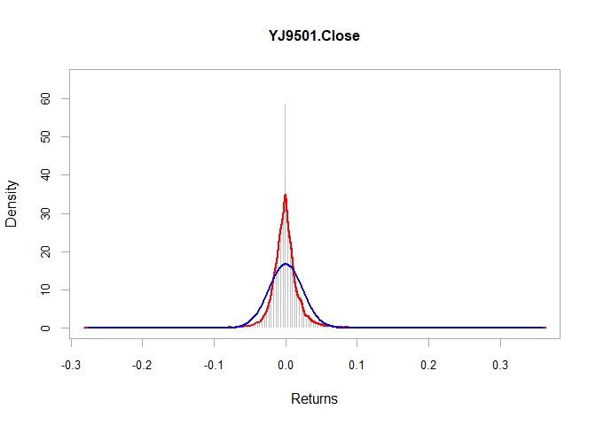

``` r
chart.Histogram(
  tepco_rt, 
  methods = c("add.density", "add.normal"),
  colorset = c("gray", "red", "blue"),
  ylim = c(0, 0.3)
)
```

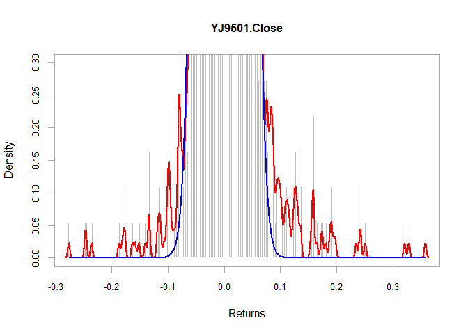

Fit the Student t distribution
==============================

``` r
tfit <- fit.st(tepco_rt_num)
tpars <- tfit$par.ests
tpars
```

    ##            nu            mu         sigma 
    ##  2.3034461766  0.0008151239 -0.0112117384

``` r
nu_t <- tpars[1]
mu_t <- tpars[2]
sigma_t <- tpars[3]*-1
```

``` r
hist(tepco_rt_num, nclass = 100, probability = TRUE)
lines(tepco_rt_num, dnorm(tepco_rt_num, mean = mu, sd = sigma), col = "red")
tval <- dt((tepco_rt_num - mu_t)/sigma_t, df = nu_t)/sigma_t
lines(tepco_rt_num, tval, col = "blue")
```

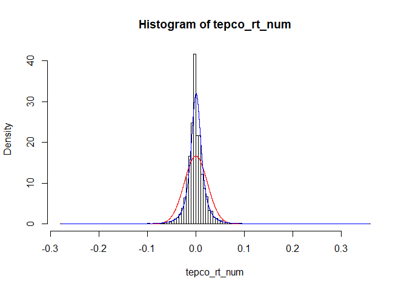

Autocorrelation
===============

``` r
acf(tepco_rt)
```

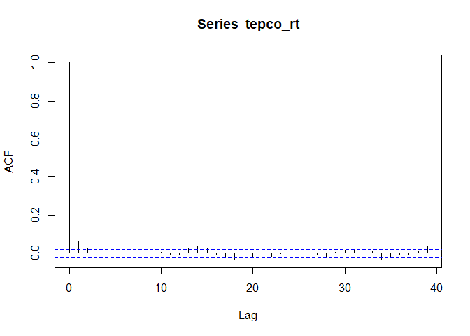

``` r
acf(abs(tepco_rt))
```

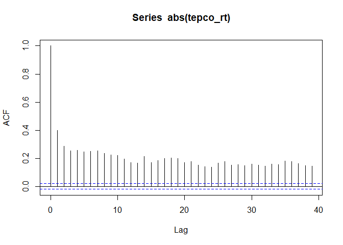

Ljung-Box test
==============

``` r
Box.test(tepco_rt, lag = 10, type = "Ljung")
```

    ## 
    ##  Box-Ljung test
    ## 
    ## data:  tepco_rt
    ## X-squared = 69.629, df = 10, p-value = 5.229e-11

``` r
Box.test(abs(tepco_rt), lag = 10, type = "Ljung")
```

    ## 
    ##  Box-Ljung test
    ## 
    ## data:  abs(tepco_rt)
    ## X-squared = 6551.9, df = 10, p-value < 2.2e-16

It says it's not iid.

Model
=====

``` r
garchspec <- ugarchspec(
  mean.model = list(armaOrder = c(0, 0)),
  variance.model = list(model = "sGARCH"),
  distribution.model = "sstd"
)

garchfit <- ugarchfit(
  data = tepco_rt, 
  spec = garchspec
)
```

``` r
# Coefficients
garchcoef <- coef(garchfit)

# Unconditional variance
garchuncvar <- uncvariance(garchfit)

# Predicted mean
garchmean <- fitted(garchfit)

# Predicted volatility
garchvol <- sigma(garchfit)
```

Estimated volatilities
======================

``` r
plot(garchvol)
```

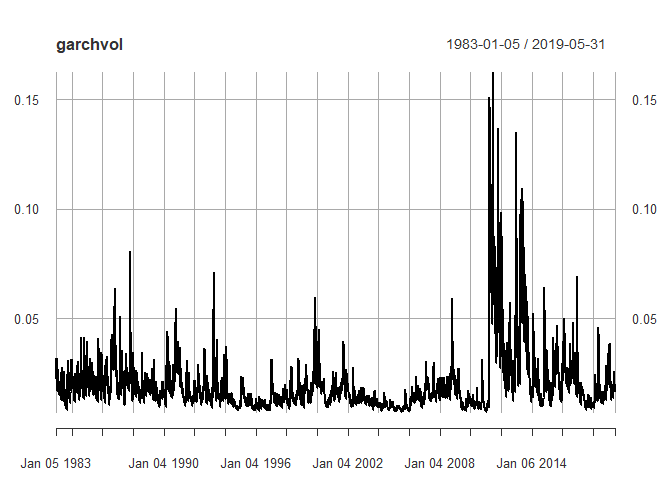

``` r
garchforecast <- ugarchforecast(
  fitORspec = garchfit,
  n.ahead = 5
)

# Volatility forecast
sigma(garchforecast)
```

    ##     2019-05-31
    ## T+1 0.02007618
    ## T+2 0.02021233
    ## T+3 0.02034743
    ## T+4 0.02048150
    ## T+5 0.02061457

``` r
# Mean forecast
fitted(garchforecast)
```

    ##       2019-05-31
    ## T+1 0.0001189136
    ## T+2 0.0001189136
    ## T+3 0.0001189136
    ## T+4 0.0001189136
    ## T+5 0.0001189136
