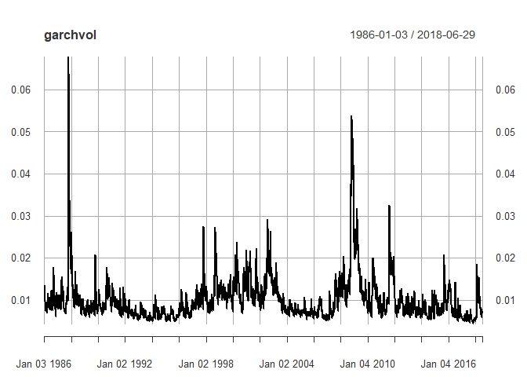

GARCH model of S&P500
================

Apply GARCH model to S&P500 daily return data. GARCH model predicts future volatility of return.

Setup
=====

``` r
library(PerformanceAnalytics)
library(rugarch)
library(xts)
```

Data
====

``` r
sp_df <- read.csv("spx.csv", head = T)
dates <- as.Date(sp_df$date, format = "%d-%b-%y")
sp_xts <- xts(x = sp_df$close,
              order.by = dates)
colnames(sp_xts) <- "close"
head(sp_xts)
```

    ##             close
    ## 1986-01-02 209.59
    ## 1986-01-03 210.88
    ## 1986-01-06 210.65
    ## 1986-01-07 213.80
    ## 1986-01-08 207.97
    ## 1986-01-09 206.11

Transformation
==============

``` r
sp <- CalculateReturns(sp_xts)[-1]
head(sp)
```

    ##                    close
    ## 1986-01-03  0.0061548738
    ## 1986-01-06 -0.0010906677
    ## 1986-01-07  0.0149537147
    ## 1986-01-08 -0.0272684752
    ## 1986-01-09 -0.0089435976
    ## 1986-01-10 -0.0007277667

EDA
===

``` r
plot.zoo(sp)
```


``` r
hist(sp, nclass = 50)
```


``` r
summary(sp)
```

    ##      Index                close           
    ##  Min.   :1986-01-03   Min.   :-0.2046693  
    ##  1st Qu.:1994-02-05   1st Qu.:-0.0043270  
    ##  Median :2002-03-26   Median : 0.0005923  
    ##  Mean   :2002-03-26   Mean   : 0.0003775  
    ##  3rd Qu.:2010-05-12   3rd Qu.: 0.0056006  
    ##  Max.   :2018-06-29   Max.   : 0.1158004

``` r
# Compute daily standard deviation
sd(sp)
```

    ## [1] 0.01132539

``` r
# Compute annualized standard deviation
sqrt(252) * sd(sp)
```

    ## [1] 0.179785

GARCH Model
===========

``` r
# GARCH (1,1) model with constant mean
garchspec <- ugarchspec(mean.model = list(armaOrder = c(0,0)),
                        variance.model = list(model = "sGARCH"),
                        distribution.model = "norm")

# Estimate GARCH model
garchfit <- ugarchfit(data = sp,
                      spec = garchspec)

# coefficients
garchcoef <- coef(garchfit)

# Unconditional variance
garchuncvar <- uncvariance(garchfit)

# Predicted mean
garchmean <- fitted(garchfit)

# Predicted volatilities
garchvol <- sigma(garchfit)
```

``` r
print(garchcoef)
```

    ##           mu        omega       alpha1        beta1 
    ## 6.294217e-04 1.678606e-06 9.627891e-02 8.910213e-01

``` r
sqrt(garchuncvar)
```

    ## [1] 0.01149679

``` r
garchvol <- sigma(garchfit)
plot(garchvol)
```



Forecasting future volatilities
===============================

``` r
# Forecast the volatility of the future returns
garchforecast <- ugarchforecast(fitORspec = garchfit,
                                n.ahead = 5)
sigma(garchforecast)
```

    ##      2018-06-29
    ## T+1 0.006919057
    ## T+2 0.006995997
    ## T+3 0.007071139
    ## T+4 0.007144551
    ## T+5 0.007216298
