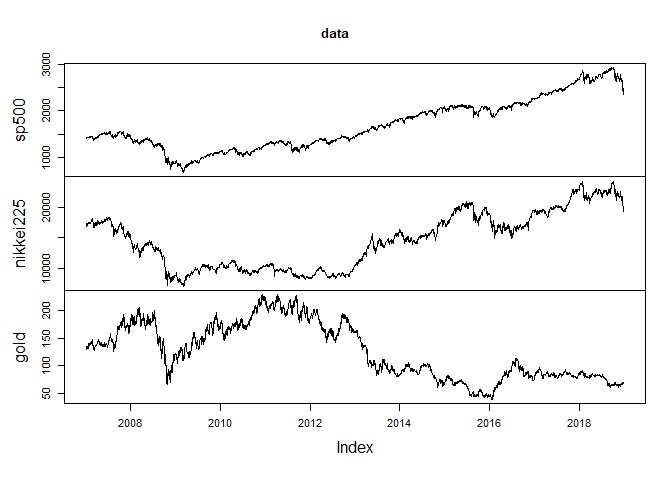
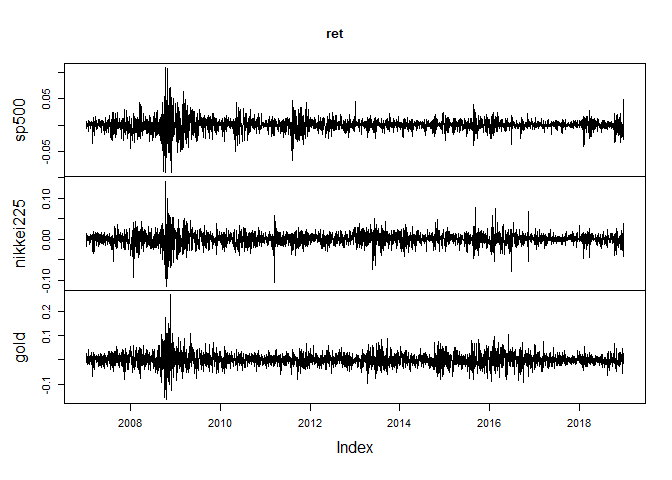
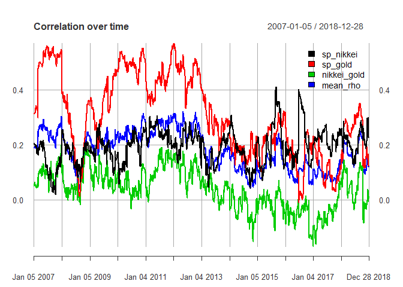

Multivariate GARCH
================

This code is to get a better understanding of multivariate GARCH model.

Package
=======

``` r
suppressMessages(library(rugarch))
```

    ## Warning: package 'rugarch' was built under R version 3.5.3

``` r
suppressMessages(library(rmgarch))
```

    ## Warning: package 'rmgarch' was built under R version 3.5.3

``` r
suppressMessages(library(quantmod))
```

    ## Warning: package 'quantmod' was built under R version 3.5.3

    ## Warning: package 'xts' was built under R version 3.5.2

    ## Warning: package 'zoo' was built under R version 3.5.3

    ## Warning: package 'TTR' was built under R version 3.5.3

``` r
suppressMessages(library(xts))
suppressMessages(library(PerformanceAnalytics))
```

    ## Warning: package 'PerformanceAnalytics' was built under R version 3.5.3

Data
====

``` r
data <- readRDS("SP500_N225_1965-01-05_2019-07-03.rds")
data <- data["200701/201812"]

getSymbols(
  "^XAU",
  from = "2007-01-01",
  to = "2018-12-31"
)
```

    ## 'getSymbols' currently uses auto.assign=TRUE by default, but will
    ## use auto.assign=FALSE in 0.5-0. You will still be able to use
    ## 'loadSymbols' to automatically load data. getOption("getSymbols.env")
    ## and getOption("getSymbols.auto.assign") will still be checked for
    ## alternate defaults.
    ## 
    ## This message is shown once per session and may be disabled by setting 
    ## options("getSymbols.warning4.0"=FALSE). See ?getSymbols for details.

    ## [1] "^XAU"

``` r
XAU <- XAU$XAU.Close
colnames(XAU) <- "gold"

data <- merge(data, XAU, join = "inner", fill = na.locf)

ret <- CalculateReturns(data)[-1]
dim(ret)
```

    ## [1] 2859    3

``` r
head(ret)
```

    ##                    sp500    nikkei225         gold
    ## 2007-01-05 -0.0060845814 -0.015102286 -0.010192776
    ## 2007-01-09  0.0017024949  0.008552726 -0.006764838
    ## 2007-01-10  0.0019403524 -0.017134998 -0.011578614
    ## 2007-01-11  0.0063398736 -0.006152049  0.006890697
    ## 2007-01-12  0.0048531656  0.012996653  0.024865061
    ## 2007-01-16  0.0008177951  0.008527355 -0.013132542

``` r
tail(ret)
```

    ##                   sp500    nikkei225         gold
    ## 2018-12-20 -0.015772106 -0.028365834  0.047740579
    ## 2018-12-21 -0.020588228 -0.011101618 -0.016048187
    ## 2018-12-24 -0.027112254  0.000000000  0.027377385
    ## 2018-12-26  0.049593743 -0.041610682 -0.008079376
    ## 2018-12-27  0.008562681  0.038834596  0.011431780
    ## 2018-12-28 -0.001241583 -0.003130332 -0.015541099

``` r
plot.zoo(data)
```



``` r
plot.zoo(ret)
```



GARCH
=====

``` r
# Fit GARCH process
gjrtspec <- ugarchspec(
  mean.model = list(armaOrder = c(0,0)),
  variance.model = list(model = "gjrGARCH"),
  distribution.model = "std"
)

l <- dim(ret)[2]

# DCC specification - GARCH(1,1) for conditional correlations
dcc_spec <- dccspec(
  uspec = multispec(replicate(l, gjrtspec)),
  distribution = "mvt"
)

# Fit FCC
garchdccfit <- dccfit(
  dcc_spec,
  ret,
  fit.control = list(scale = TRUE)
)
```

``` r
print(garchdccfit)
```

    ## 
    ## *---------------------------------*
    ## *          DCC GARCH Fit          *
    ## *---------------------------------*
    ## 
    ## Distribution         :  mvt
    ## Model                :  DCC(1,1)
    ## No. Parameters       :  24
    ## [VAR GARCH DCC UncQ] : [0+18+3+3]
    ## No. Series           :  3
    ## No. Obs.             :  2859
    ## Log-Likelihood       :  24681.03
    ## Av.Log-Likelihood    :  8.63 
    ## 
    ## Optimal Parameters
    ## -----------------------------------
    ##                     Estimate  Std. Error    t value Pr(>|t|)
    ## [sp500].mu          0.000585    0.000125   4.682362 0.000003
    ## [sp500].omega       0.000002    0.000002   1.188114 0.234789
    ## [sp500].alpha1      0.000019    0.015666   0.001199 0.999044
    ## [sp500].beta1       0.870087    0.025432  34.211661 0.000000
    ## [sp500].gamma1      0.245259    0.058243   4.210992 0.000025
    ## [sp500].shape       5.003225    0.538727   9.287129 0.000000
    ## [nikkei225].mu      0.000538    0.000222   2.426615 0.015240
    ## [nikkei225].omega   0.000006    0.000003   2.025872 0.042778
    ## [nikkei225].alpha1  0.026529    0.019211   1.380906 0.167308
    ## [nikkei225].beta1   0.862581    0.013727  62.839868 0.000000
    ## [nikkei225].gamma1  0.174370    0.035382   4.928261 0.000001
    ## [nikkei225].shape   7.357509    1.039042   7.081051 0.000000
    ## [gold].mu          -0.000350    0.000382  -0.914077 0.360677
    ## [gold].omega        0.000004    0.000004   0.821317 0.411466
    ## [gold].alpha1       0.021787    0.014801   1.472039 0.141010
    ## [gold].beta1        0.945208    0.019451  48.594024 0.000000
    ## [gold].gamma1       0.058462    0.013685   4.271985 0.000019
    ## [gold].shape       11.535877    2.403911   4.798795 0.000002
    ## [Joint]dcca1        0.011734    0.002614   4.488561 0.000007
    ## [Joint]dccb1        0.983865    0.004126 238.440401 0.000000
    ## [Joint]mshape       8.361538    0.640188  13.061061 0.000000
    ## 
    ## Information Criteria
    ## ---------------------
    ##                     
    ## Akaike       -17.249
    ## Bayes        -17.199
    ## Shibata      -17.249
    ## Hannan-Quinn -17.231
    ## 
    ## 
    ## Elapsed time : 7.663504

``` r
slotNames(garchdccfit)
```

    ## [1] "mfit"  "model"

``` r
names(garchdccfit@model)
```

    ##  [1] "modelinc"      "modeldesc"     "modeldata"     "varmodel"     
    ##  [5] "pars"          "start.pars"    "fixed.pars"    "maxgarchOrder"
    ##  [9] "maxdccOrder"   "pos.matrix"    "pidx"          "DCC"          
    ## [13] "mu"            "residuals"     "sigma"         "mpars"        
    ## [17] "ipars"         "midx"          "eidx"          "umodel"

``` r
names(garchdccfit@mfit)
```

    ##  [1] "coef"            "matcoef"         "garchnames"     
    ##  [4] "dccnames"        "cvar"            "scores"         
    ##  [7] "R"               "H"               "Q"              
    ## [10] "stdresid"        "llh"             "log.likelihoods"
    ## [13] "timer"           "convergence"     "Nbar"           
    ## [16] "Qbar"            "plik"

``` r
# for covariance
dcccov <- rcov(garchdccfit)

# for correlation
dcccor <- rcor(garchdccfit)
dim(dcccor)
```

    ## [1]    3    3 2859

``` r
dcccor[,,1]
```

    ##               sp500  nikkei225       gold
    ## sp500     1.0000000 0.20217955 0.31372717
    ## nikkei225 0.2021796 1.00000000 0.05060298
    ## gold      0.3137272 0.05060298 1.00000000

``` r
mean_rho <- apply(
  cbind(dcccor[1,2,], dcccor[1,3,], dcccor[2,3,]),
  1,
  mean
  )

cormat <- cbind(dcccor[1,2,], dcccor[1,3,], dcccor[2,3,],mean_rho)
colnames(cormat)[1:3] <- c("sp_nikkei", "sp_gold", "nikkei_gold")
cormat <- xts(cormat, order.by = index(ret))
```

``` r
plot.xts(cormat, 
         legend.loc = "topright",
         main = "Correlation over time")
```


