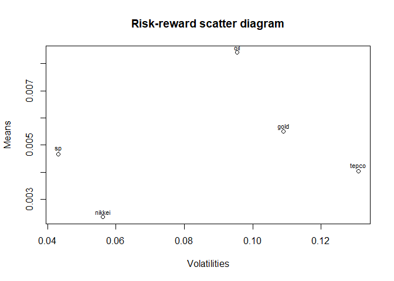

Portfolio analysis
================

Package
=======

``` r
library(xts)
library(quantmod)
library(tseries)
library(PerformanceAnalytics)
```

Data
====

``` r
price <- readRDS("Portfolio_monthly_19980101_20181231.rds")
head(price)
```

    ##                 sp   nikkei  gold   oil tepco
    ## 1998-01-30  980.28 16628.47 74.97 17.21  2370
    ## 1998-02-27 1049.34 16831.67 75.45 15.44  2380
    ## 1998-03-31 1101.75 16527.17 81.67 15.75  2520
    ## 1998-04-30 1111.75 15641.26 87.93 15.56  2535
    ## 1998-05-29 1090.82 15670.78 74.71 15.21  2650
    ## 1998-06-30 1133.84 15830.27 71.72 14.30  2720

``` r
plot.zoo(price)
```


Return data
===========

``` r
returns <- CalculateReturns(price)[-1, ]
plot.zoo(returns)
```


Annualized mean and volatility
==============================

``` r
table.AnnualizedReturns(returns)
```

    ##                               sp nikkei    gold    oil   tepco
    ## Annualized Return         0.0455 0.0089 -0.0035 0.0472 -0.0598
    ## Annualized Std Dev        0.1492 0.1945  0.3775 0.3302  0.4532
    ## Annualized Sharpe (Rf=0%) 0.3048 0.0458 -0.0093 0.1429 -0.1319

Mean-variance efficient portfolio
=================================

``` r
opt <- portfolio.optim(returns)
pf_weights <- opt$pw
names(pf_weights) <- colnames(returns)
barplot(pf_weights)
```


``` r
# Expected portfolio return 
opt$pm
```

    ## [1] 0.004985762

``` r
# Expected portfolio volatility
opt$ps
```

    ## [1] 0.04059074

Imposing weight constraints
===========================

``` r
max_weights <- rep(0.3, ncol(returns))
opt <- portfolio.optim(returns, reshigh = max_weights)

# Portfolio weights
opt$pw
```

    ## [1] 0.30000000 0.25743387 0.11331817 0.23695232 0.09229564

``` r
# Returns of the overall portfolio
# opt$px

# Expected return portfolio
opt$pm
```

    ## [1] 0.004985762

``` r
# Standard deviation of the portfolio return
opt$ps
```

    ## [1] 0.04564829

Split-sample evaluation
=======================

In-sample Out-of-sample evaluation.

``` r
const <- 0.5

returns_estim <- window(returns, start = "1998-01-01", end = "2007-12-31")
returns_eval <- window(returns, start = "2008-01-01", end = "2018-12-31")

max_weights <- rep(const, ncol(returns))

pf_estim <- portfolio.optim(returns_estim, reshigh = max_weights)
pf_eval <- portfolio.optim(returns_eval, reshigh = max_weights)

plot(pf_estim$pw, pf_eval$pw, 
     xlim = c(0, const), ylim = c(0, const),
     xlab = "Portfolio with estimation sample",
     ylab = "Portfolio with evaluation sample",
     main = "Split-sample evaluation")
abline(a = 0, b = 1, lty = 3)
text(pf_estim$pw, pf_eval$pw+0.04, labels = colnames(returns))
```


a scatter plot of the evaluation portfolio weights versus the estimation portfolio weights. If portfolio weights are identical, they should be on the 45 degree line.

Out of sample performance evaluation
====================================

Illustrate how our returns can change based on the weights created by an optimized portfolio. Calculate the returns of the portfolio with monthly rebalance weights on the estimation sample.

``` r
returns_pf_estim <- Return.portfolio(
  returns_estim,
  pf_estim$pw,
  rebalance_on = "months"
)

returns_pf_eval <- Return.portfolio(
  returns_eval,
  pf_estim$pw,
  rebalance_on = "months"
)
```

``` r
# Print a table for estimation portfolio
table.AnnualizedReturns(returns_pf_estim)
```

    ##                           portfolio.returns
    ## Annualized Return                    0.0927
    ## Annualized Std Dev                   0.1174
    ## Annualized Sharpe (Rf=0%)            0.7890

``` r
# Print a table for evaluation portfolio
table.AnnualizedReturns(returns_pf_eval)
```

    ##                           portfolio.returns
    ## Annualized Return                    0.0129
    ## Annualized Std Dev                   0.2269
    ## Annualized Sharpe (Rf=0%)            0.0570

Correlation
===========

``` r
chart.Correlation(returns)
```


Rolling 24-month estimates of correlation
=========================================

``` r
chart.RollingCorrelation(returns$sp, returns$nikkei, width = 24)
```


``` r
chart.RollingCorrelation(returns$nikkei, returns$gold, width = 24)
```


Risk-reward scatter diagram
===========================

``` r
means <- apply(returns, 2, mean)
sds <- apply(returns, 2, sd)

plot(sds, means, 
     xlab = "Volatilities",
     ylab = "Means",
     main = "Risk-reward scatter diagram")
text(sds, means+0.0002, labels = colnames(returns), cex = 0.7)
abline(h = 0, lty = 3)
```



Risk budget
===========

How large each asset's percent risk contribution is in the total portfolio volatility.

``` r
weights <- rep(0.2, 5)

# Make volatility budget
vol_budget <- StdDev(returns, portfolio_method = "component", weights = weights)

# Create a table of weights and risk contribution
weights_percrisk <- cbind(weights, vol_budget$pct_contrib_StdDev)
colnames(weights_percrisk) <- c("weights", "perc vol contrib")

weights_percrisk
```

    ##        weights perc vol contrib
    ## sp         0.2       0.09150938
    ## nikkei     0.2       0.13154875
    ## gold       0.2       0.25013872
    ## oil        0.2       0.23280612
    ## tepco      0.2       0.29399703

Rolling annualized mean and volatility
======================================

``` r
chart.RollingPerformance(
  R = returns$sp,
  width = 12,
  FUN = "Return.annualized"
)
```


``` r
chart.RollingPerformance(
  R = returns$sp,
  width = 12,
  FUN = "StdDev.annualized"
)
```


Downside risk measures
======================

``` r
# Semi-deviation: variability of returns below the mean return
SemiDeviation(returns$nikkei)
```

    ##                    nikkei
    ## Semi-Deviation 0.04199444

``` r
# Value at risk
VaR(returns$nikkei)
```

    ##          nikkei
    ## VaR -0.09473446

``` r
# Expected shortfall
ES(returns$nikkei)
```

    ##        nikkei
    ## ES -0.1433515

Drawdown episodes
=================

``` r
table.Drawdowns(returns$gold)
```

    ##         From     Trough         To   Depth Length To Trough Recovery
    ## 1 2011-01-31 2015-12-31       <NA> -0.8001     97        60       NA
    ## 2 2008-03-31 2008-10-31 2010-09-30 -0.5876     31         8       23
    ## 3 1998-05-29 2000-10-31 2003-08-29 -0.5011     64        30       34
    ## 4 2003-12-31 2004-04-30 2005-09-30 -0.2528     22         5       17
    ## 5 2006-05-31 2006-09-29 2007-09-28 -0.1878     17         5       12

``` r
chart.Drawdown(returns$gold)
```


Efficient frontier
==================

``` r
# returnmu <- colMeans(returns)
# grid <- seq(from = 0.01, to = max(returnmu), length.out = 50)
# vpm <- vpsd <- rep(NA, length(grid))
# mweights <- matrix(NA, 50, ncol(returns))

# for (i in 1:length(grid)) {
#   opt <- portfolio.optim(x = returns, pm = grid[i])
#   vpm[i] <- opt$pm
#   vpsd[i] <- opt$ps
#   mweights[i, ] <- opt$pw
# }
```
