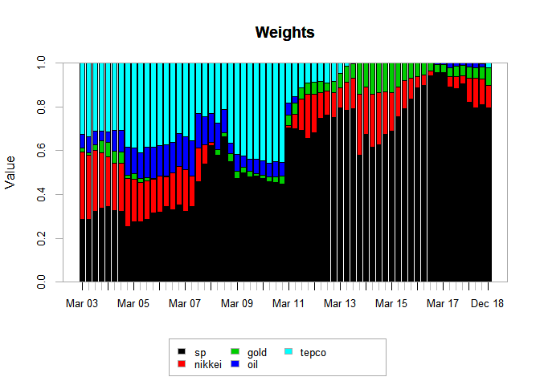

Portfolio analysis
================

Package
=======

``` r
library(xts)
library(quantmod)
library(tseries)
library(PerformanceAnalytics)
library(PortfolioAnalytics)
library(ROI)
library(ROI.plugin.quadprog)
library(ROI.plugin.glpk)
```

Data
====

``` r
price <- readRDS("Portfolio_monthly_19980101_20181231.rds")
head(price)
```

    ##                 sp   nikkei  gold   oil tepco
    ## 1998-01-30  980.28 16628.47 74.97 17.21  2370
    ## 1998-02-27 1049.34 16831.67 75.45 15.44  2380
    ## 1998-03-31 1101.75 16527.17 81.67 15.75  2520
    ## 1998-04-30 1111.75 15641.26 87.93 15.56  2535
    ## 1998-05-29 1090.82 15670.78 74.71 15.21  2650
    ## 1998-06-30 1133.84 15830.27 71.72 14.30  2720

Use monthly data.

``` r
plot.zoo(price)
```


Return data
===========

``` r
returns <- CalculateReturns(price)[-1, ]
plot.zoo(returns)
```


Annualized mean and volatility
==============================

``` r
table.AnnualizedReturns(returns)
```

    ##                               sp nikkei    gold    oil   tepco
    ## Annualized Return         0.0455 0.0089 -0.0035 0.0472 -0.0598
    ## Annualized Std Dev        0.1492 0.1945  0.3775 0.3302  0.4532
    ## Annualized Sharpe (Rf=0%) 0.3048 0.0458 -0.0093 0.1429 -0.1319

Correlation
===========

``` r
chart.Correlation(returns)
```


Risk-reward scatter diagram
===========================

``` r
means <- apply(returns, 2, mean)
sds <- apply(returns, 2, sd)

plot(sds, means, 
     xlab = "Volatilities",
     ylab = "Means",
     main = "Risk-reward scatter diagram",
     xlim = c(0.04, 0.14),
     ylim = c(0.002, 0.009))
text(sds, means+0.0005, labels = colnames(returns), cex = 1)
abline(h = 0, lty = 3)
```


Mean - Standard Deviation
=========================

``` r
port_spec <- portfolio.spec(colnames(returns))
port_spec <- add.constraint(portfolio = port_spec, type = "full_investment")
port_spec <- add.constraint(portfolio = port_spec, type = "long_only")
port_spec <- add.objective(portfolio = port_spec, type = "return", name = "mean")
port_spec <- add.objective(portfolio = port_spec, type = "risk", name = "StdDev")
print(port_spec)
```

    ## **************************************************
    ## PortfolioAnalytics Portfolio Specification 
    ## **************************************************
    ## 
    ## Call:
    ## portfolio.spec(assets = colnames(returns))
    ## 
    ## Number of assets: 5 
    ## Asset Names
    ## [1] "sp"     "nikkei" "gold"   "oil"    "tepco" 
    ## 
    ## Constraints
    ## Enabled constraint types
    ##      - full_investment 
    ##      - long_only 
    ## 
    ## Objectives:
    ## Enabled objective names
    ##      - mean 
    ##      - StdDev

``` r
opt <- optimize.portfolio(returns, portfolio = port_spec, optimize_method = "random", trace = TRUE)
```

    ## Leverage constraint min_sum and max_sum are restrictive, 
    ##               consider relaxing. e.g. 'full_investment' constraint should be min_sum=0.99 and max_sum=1.01

    ## Warning: executing %dopar% sequentially: no parallel backend registered

``` r
chart.RiskReward(opt, risk.col = "StdDev", return.col = "mean", chart.assets = TRUE)
```


Equal weight benchmark
======================

``` r
# setup
n <- ncol(returns)
equal_weight <- rep(1/n, n)

# calculate return
benchmark_returns <- Return.portfolio(
  R = returns,
  weights = equal_weight,
  rebalance_on = "years"
)
colnames(benchmark_returns) <- "benchmark"

# Benchmark performace
table.AnnualizedReturns(benchmark_returns)
```

    ##                           benchmark
    ## Annualized Return            0.0549
    ## Annualized Std Dev           0.1884
    ## Annualized Sharpe (Rf=0%)    0.2914

Base portfolio
==============

A simple approach with relaxed constraints and basic objective.

``` r
# Base portfolio specification
base_port_spec <- portfolio.spec(assets = colnames(returns))
base_port_spec <- add.constraint(portfolio = base_port_spec, type = "full_investment")
base_port_spec <- add.constraint(portfolio = base_port_spec, type = "long_only")
base_port_spec <- add.objective(portfolio = base_port_spec, type= "risk", name = "StdDev")
```

``` r
opt_base <- optimize.portfolio.rebalancing(
  R = returns,
  optimize_method = "ROI",
  portfolio = base_port_spec,
  rebalance_on = "quarters",
  training_period = 60,
  rolling_window = 60
)

# Calculate portfolio returns
base_returns <- Return.portfolio(returns, extractWeights(opt_base))
colnames(base_returns) <- "base"
```

``` r
# Chart the optimal weights
chart.Weights(opt_base)
```



``` r
# Merge benchmark and base portfolio returns
ret <- cbind(benchmark_returns, base_returns)

# Annualized performance
table.AnnualizedReturns(ret)
```

    ##                           benchmark   base
    ## Annualized Return            0.0549 0.0280
    ## Annualized Std Dev           0.1884 0.1547
    ## Annualized Sharpe (Rf=0%)    0.2914 0.1810

Refine constraints.

``` r
box_port_spec <- base_port_spec

print(box_port_spec)
```

    ## **************************************************
    ## PortfolioAnalytics Portfolio Specification 
    ## **************************************************
    ## 
    ## Call:
    ## portfolio.spec(assets = colnames(returns))
    ## 
    ## Number of assets: 5 
    ## Asset Names
    ## [1] "sp"     "nikkei" "gold"   "oil"    "tepco" 
    ## 
    ## Constraints
    ## Enabled constraint types
    ##      - full_investment 
    ##      - long_only 
    ## 
    ## Objectives:
    ## Enabled objective names
    ##      - StdDev

Use indexnum argument to update specifications. For example, indexnum = 2 updates the second constraints from "long\_only" to "box".

``` r
# Update the contraints
box_port_spec <- add.constraint(portfolio = box_port_spec, type = "box", min = 0.01, max = 0.6, indexnum = 2)

print(box_port_spec)
```

    ## **************************************************
    ## PortfolioAnalytics Portfolio Specification 
    ## **************************************************
    ## 
    ## Call:
    ## portfolio.spec(assets = colnames(returns))
    ## 
    ## Number of assets: 5 
    ## Asset Names
    ## [1] "sp"     "nikkei" "gold"   "oil"    "tepco" 
    ## 
    ## Constraints
    ## Enabled constraint types
    ##      - full_investment 
    ##      - box 
    ## 
    ## Objectives:
    ## Enabled objective names
    ##      - StdDev

``` r
# Backtest
opt_box <- optimize.portfolio.rebalancing(
  R = returns,
  optimize_method = "ROI",
  portfolio = box_port_spec,
  rebalance_on = "quarters",
  training_period = 60,
  rolling_window = 60
)

# Calculate portfolio returns
box_returns <- Return.portfolio(returns, extractWeights(opt_box))
colnames(box_returns) <- "box"

# Chart the optimal weights
chart.Weights(opt_box)
```


``` r
# Merge box portfolio returns
ret <- cbind(ret, box_returns)

# Annualized performance
table.AnnualizedReturns(ret)
```

    ##                           benchmark   base    box
    ## Annualized Return            0.0549 0.0280 0.0278
    ## Annualized Std Dev           0.1884 0.1547 0.1559
    ## Annualized Sharpe (Rf=0%)    0.2914 0.1810 0.1782

Mean-variance efficient portfolio
=================================

``` r
opt <- portfolio.optim(returns)
pf_weights <- opt$pw
names(pf_weights) <- colnames(returns)
barplot(pf_weights)
```


``` r
# Expected portfolio return 
opt$pm
```

    ## [1] 0.004985762

``` r
# Expected portfolio volatility
opt$ps
```

    ## [1] 0.04059074

Imposing weight constraints
===========================

``` r
max_weights <- rep(0.3, ncol(returns))
opt <- portfolio.optim(returns, reshigh = max_weights)

# Portfolio weights
opt$pw
```

    ## [1] 0.30000000 0.25743387 0.11331817 0.23695232 0.09229564

``` r
# Returns of the overall portfolio
# opt$px

# Expected return portfolio
opt$pm
```

    ## [1] 0.004985762

``` r
# Standard deviation of the portfolio return
opt$ps
```

    ## [1] 0.04564829

Split-sample evaluation
=======================

In-sample Out-of-sample evaluation.

``` r
const <- 0.5

returns_estim <- window(returns, start = "1998-01-01", end = "2007-12-31")
returns_eval <- window(returns, start = "2008-01-01", end = "2018-12-31")

max_weights <- rep(const, ncol(returns))

pf_estim <- portfolio.optim(returns_estim, reshigh = max_weights)
pf_eval <- portfolio.optim(returns_eval, reshigh = max_weights)

plot(pf_estim$pw, pf_eval$pw, 
     xlim = c(0, const), ylim = c(0, const),
     xlab = "Portfolio with estimation sample",
     ylab = "Portfolio with evaluation sample",
     main = "Split-sample evaluation")
abline(a = 0, b = 1, lty = 3)
text(pf_estim$pw, pf_eval$pw+0.04, labels = colnames(returns))
```


a scatter plot of the evaluation portfolio weights versus the estimation portfolio weights. If portfolio weights are identical, they should be on the 45 degree line.

Out of sample performance evaluation
====================================

Illustrate how our returns can change based on the weights created by an optimized portfolio. Calculate the returns of the portfolio with monthly rebalance weights on the estimation sample.

``` r
returns_pf_estim <- Return.portfolio(
  returns_estim,
  pf_estim$pw,
  rebalance_on = "months"
)

returns_pf_eval <- Return.portfolio(
  returns_eval,
  pf_estim$pw,
  rebalance_on = "months"
)
```

``` r
# Print a table for estimation portfolio
table.AnnualizedReturns(returns_pf_estim)
```

    ##                           portfolio.returns
    ## Annualized Return                    0.0927
    ## Annualized Std Dev                   0.1174
    ## Annualized Sharpe (Rf=0%)            0.7890

``` r
# Print a table for evaluation portfolio
table.AnnualizedReturns(returns_pf_eval)
```

    ##                           portfolio.returns
    ## Annualized Return                    0.0129
    ## Annualized Std Dev                   0.2269
    ## Annualized Sharpe (Rf=0%)            0.0570

Risk budget
===========

How large each asset's percent risk contribution is in the total portfolio volatility.

``` r
weights <- rep(0.2, 5)

# Make volatility budget
vol_budget <- StdDev(returns, portfolio_method = "component", weights = weights)

# Create a table of weights and risk contribution
weights_percrisk <- cbind(weights, vol_budget$pct_contrib_StdDev)
colnames(weights_percrisk) <- c("weights", "perc vol contrib")

weights_percrisk
```

    ##        weights perc vol contrib
    ## sp         0.2       0.09150938
    ## nikkei     0.2       0.13154875
    ## gold       0.2       0.25013872
    ## oil        0.2       0.23280612
    ## tepco      0.2       0.29399703

``` r
# extractWeights(opt)
```

``` r
# chart.Weights(opt)
```

``` r
# port_spec <- portfolio.spec(assets = colnames(returns))
# port_spec <- add.constraint(portfolio = port_spec, type = "full_investment")
# port_spec <- add.constraint(portfolio = port_spec, type = "long_only")
# poer_spec <- add.objective(portfolio = port_spec, type = "return", name = "mean")
# port_spec <- add.objective(portfolio = port_spec, type = "risk", name = "var", risk_aversion = 10)
# print(port_spec)
```

``` r
# opt <- optimize.portfolio(R = returns, portfolio = port_spec, optimize_method = "ROI")
# print(opt)
```

``` r
# extractWeights(opt)
```

``` r
# chart.Weights(opt)
```

Rebalancing
===========

``` r
# opt_rebal <- optimize.portfolio.rebalancing(
#   R = returns,
#   portfolio = port_spec,
#   optimize_method = "ROI",
#   rebalance_on = "quarters",
#   training_period = 60,
#   rolling_window = 60
# )
```

``` r
# chart.Weights(opt_rebal)
```
