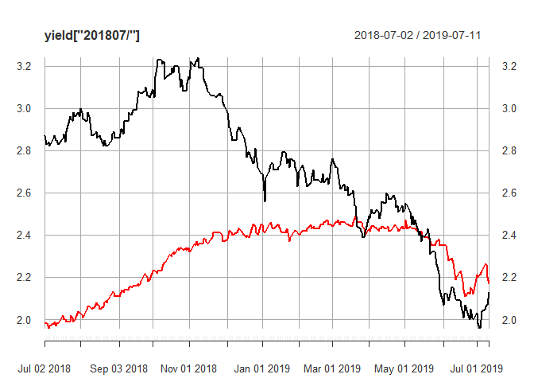

US Treasury
================

``` r
suppressMessages(library(quantmod))
```

    ## Warning: package 'quantmod' was built under R version 3.5.3

    ## Warning: package 'xts' was built under R version 3.5.2

    ## Warning: package 'zoo' was built under R version 3.5.3

    ## Warning: package 'TTR' was built under R version 3.5.3

``` r
t10yr <- getSymbols(
  Symbols = "DGS10",
  src = "FRED",
  auto.assign = FALSE
)
```

    ## 'getSymbols' currently uses auto.assign=TRUE by default, but will
    ## use auto.assign=FALSE in 0.5-0. You will still be able to use
    ## 'loadSymbols' to automatically load data. getOption("getSymbols.env")
    ## and getOption("getSymbols.auto.assign") will still be checked for
    ## alternate defaults.
    ## 
    ## This message is shown once per session and may be disabled by setting 
    ## options("getSymbols.warning4.0"=FALSE). See ?getSymbols for details.

``` r
t3mo <- getSymbols(
  Symbols = "DGS3MO",
  src = "FRED",
  auto.assign = FALSE
)
```

Merge
=====

``` r
yield <- merge(t10yr, t3mo, join = "inner", fill = na.locf)
```

EDA
===

``` r
plot(yield)
```


``` r
plot(yield["201807/"])
```


