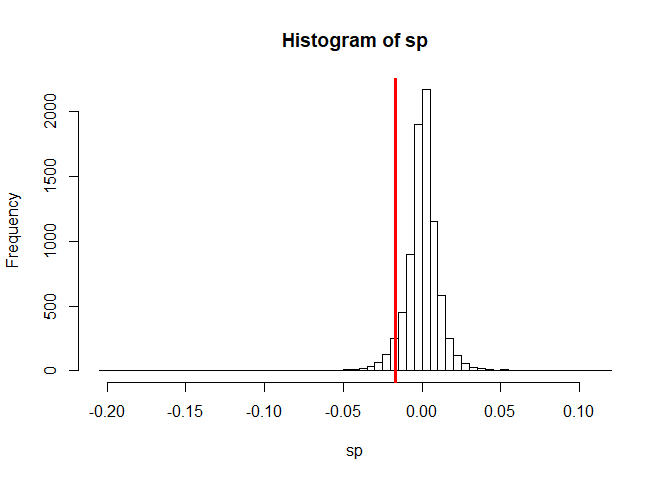
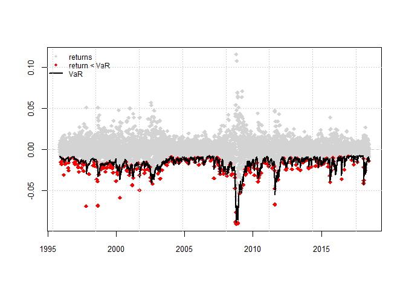

VaR of S&P500
================

Package
=======

``` r
suppressMessages(library(rugarch))
```

    ## Warning: package 'rugarch' was built under R version 3.5.3

``` r
suppressMessages(library(PerformanceAnalytics))
```

    ## Warning: package 'PerformanceAnalytics' was built under R version 3.5.3

    ## Warning: package 'xts' was built under R version 3.5.2

    ## Warning: package 'zoo' was built under R version 3.5.3

``` r
suppressMessages(library(xts))
# suppressMessages(library(rmgarch))
# http://www.unstarched.net/
```

Data
====

``` r
sp <- read.csv("spx.csv", head = T)
dates <- as.Date(sp$date, format = "%d-%b-%y")
sp <- xts(x = sp$close,
              order.by = dates)
colnames(sp) <- "close"
sp <- CalculateReturns(sp)[-1]
head(sp)
```

    ##                    close
    ## 1986-01-03  0.0061548738
    ## 1986-01-06 -0.0010906677
    ## 1986-01-07  0.0149537147
    ## 1986-01-08 -0.0272684752
    ## 1986-01-09 -0.0089435976
    ## 1986-01-10 -0.0007277667

EDA
===

``` r
sp_5_quant <- quantile(sp, probs = 0.05)
hist(sp, nclass = 100)
abline(v = sp_5_quant, col = "red", lwd = 3)
```



``` r
sp_5_quant
```

    ##          5% 
    ## -0.01694837

Model
=====

``` r
garchspec_1 <- ugarchspec(
  mean.model = list(armaOrder = c(1,0)),
  variance.model = list(model = "gjrGARCH"),
  distribution.model = "sstd"
)
```

``` r
garchroll_1 <- ugarchroll(
  garchspec_1,
  data = sp,
  n.start = 2500,
  refit.window = "moving",
  refit.every = 1000
)
```

``` r
garchVaR <- quantile(garchroll_1, probs = 0.05)
```

Value-at-risk plot
==================

``` r
actual <- xts(as.data.frame(garchroll_1)$Realized, time(garchVaR))
VaRplot(alpha = 0.05,
        actual = actual,
        VaR = garchVaR)
```



Exceedance and VaR coverage
===========================

Exceedance: the actual return is less than the predicted VaR.
VaR coverage: the frequency of VaR exceedance.

Valid prediction model has a coverage that is close to the probability level *α* used.
If coverage ≫(much greater than) *α*, it means that we have too many exceedances, so risk of losing money is underestimated. But if coverage ≪ *α*, it means that we have too few exceedances, so risk of losing money is overestimated.

``` r
coverage <- mean(actual < garchVaR)
coverage
```

    ## [1] 0.05394483

Model validation
================

Compare with different GARCH models to check whether VaR coverage is appropriate.

``` r
# skewed to non-skewed t distribution
garchspec_2 <- ugarchspec(
  mean.model = list(armaOrder = c(1,0)),
  variance.model = list(model = "gjrGARCH"),
  distribution.model = "std"
)

garchroll_2 <- ugarchroll(
  garchspec_2,
  data = sp,
  n.start = 2500,
  refit.window = "moving",
  refit.every = 1000
)
```

``` r
garchVaR_2 <- quantile(garchroll_2, probs = 0.05)
mean(actual < garchVaR_2)
```

    ## [1] 0.05833773

VaR coverage is larger than before. So risk of losing money is underestimated.

``` r
# GJR GARCH to standard GARCH
garchspec_3 <- ugarchspec(
  mean.model = list(armaOrder = c(1,0)),
  variance.model = list(model = "sGARCH"),
  distribution.model = "std"
)

garchroll_3 <- ugarchroll(
  garchspec_3,
  data = sp,
  n.start = 2500,
  refit.window = "moving",
  refit.every = 1000
)
```

``` r
garchVaR_3 <- quantile(garchroll_3, probs = 0.05)
mean(actual < garchVaR_3)
```

    ## [1] 0.06202776

VaR coverage is even bigger, further underestimation of risk.

``` r
# Every 1000 fit to 2000 fit
garchroll_4 <- ugarchroll(
  garchspec_3,
  data = sp,
  n.start = 2500,
  refit.window = "moving",
  refit.every = 2000
)
```

``` r
garchVaR_4 <- quantile(garchroll_4, probs = 0.05)
mean(actual < garchVaR_4)
```

    ## [1] 0.06360921

VaR is even bigger. We think that our original model, AR(1) GJR GARCH with the skewed Student t distribution and every 1,000 data re-estimation, is a good model. We see model specification and rolling estimation options is important to get a nice VaR.

Prediction about future returns
===============================

``` r
garchspec_1 <- ugarchspec(
  mean.model = list(armaOrder = c(1,0)),
  variance.model = list(model = "gjrGARCH"),
  distribution.model = "sstd"
)

garchfit_1 <- ugarchfit(
  data = sp,
  spec = garchspec_1
)

progarchspec <- garchspec_1
setfixed(progarchspec) <- as.list(coef(garchfit_1))

garchforecast <- ugarchforecast(
  data = sp,
  fitORspec = progarchspec,
  n.ahead = 10
)

cbind(fitted(garchforecast), sigma(garchforecast))
```

    ##        2018-06-29  2018-06-29
    ## T+1  0.0003775774 0.007677180
    ## T+2  0.0003869481 0.007715908
    ## T+3  0.0003867175 0.007753908
    ## T+4  0.0003867232 0.007791198
    ## T+5  0.0003867231 0.007827794
    ## T+6  0.0003867231 0.007863714
    ## T+7  0.0003867231 0.007898974
    ## T+8  0.0003867231 0.007933590
    ## T+9  0.0003867231 0.007967577
    ## T+10 0.0003867231 0.008000950

``` r
quantile(garchforecast, probs = 0.05)
```

    ##       2018-06-29
    ## T+1  -0.01225403
    ## T+2  -0.01230838
    ## T+3  -0.01237114
    ## T+4  -0.01243249
    ## T+5  -0.01249270
    ## T+6  -0.01255180
    ## T+7  -0.01260982
    ## T+8  -0.01266677
    ## T+9  -0.01272269
    ## T+10 -0.01277760
