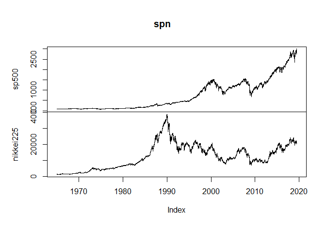
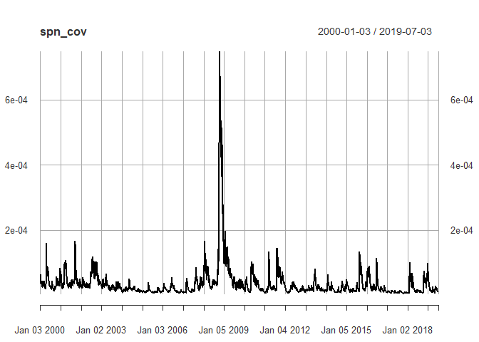

Value at Risk of S&P500 and Nikkei225
================

Package
=======

``` r
suppressMessages(library(rugarch))
```

    ## Warning: package 'rugarch' was built under R version 3.5.3

``` r
suppressMessages(library(PerformanceAnalytics))
```

    ## Warning: package 'PerformanceAnalytics' was built under R version 3.5.3

    ## Warning: package 'xts' was built under R version 3.5.2

    ## Warning: package 'zoo' was built under R version 3.5.3

``` r
suppressMessages(library(xts))
suppressMessages(library(quantmod))
```

    ## Warning: package 'quantmod' was built under R version 3.5.3

    ## Warning: package 'TTR' was built under R version 3.5.3

``` r
# suppressMessages(library(rmgarch))
# http://www.unstarched.net/
```

Data
====

``` r
# getSymbols(
#   "^GSPC",
#   src = "yahoo",
#   from = as.Date("1965-01-05")
# )
# saveRDS(GSPC, "GSPC_19650105_20190703.rds")

# getSymbols(
#   "^N225",
#   src = "yahoo",
#   from = as.Date("1965-01-05")
# )
# saveRDS(N225, "N225_19650105_20190705.rds")

sp <- readRDS("GSPC_19650105_20190703.rds")
n225 <- readRDS("N225_19650105_20190705.rds")
```

``` r
head(sp)
```

    ##            GSPC.Open GSPC.High GSPC.Low GSPC.Close GSPC.Volume
    ## 1965-01-05     84.23     85.02    84.02      84.63     4110000
    ## 1965-01-06     84.63     85.38    84.45      84.89     4850000
    ## 1965-01-07     84.89     85.62    84.66      85.26     5080000
    ## 1965-01-08     85.26     85.84    84.91      85.37     5340000
    ## 1965-01-11     85.37     85.81    84.90      85.40     5440000
    ## 1965-01-12     85.40     85.98    85.13      85.61     5400000
    ##            GSPC.Adjusted
    ## 1965-01-05         84.63
    ## 1965-01-06         84.89
    ## 1965-01-07         85.26
    ## 1965-01-08         85.37
    ## 1965-01-11         85.40
    ## 1965-01-12         85.61

``` r
tail(sp)
```

    ##            GSPC.Open GSPC.High GSPC.Low GSPC.Close GSPC.Volume
    ## 2019-06-26   2926.07   2932.59  2912.99    2913.78  3478130000
    ## 2019-06-27   2919.66   2929.30  2918.57    2924.92  3122920000
    ## 2019-06-28   2932.94   2943.98  2929.05    2941.76  5420700000
    ## 2019-07-01   2971.41   2977.93  2952.22    2964.33  3513270000
    ## 2019-07-02   2964.66   2973.21  2955.92    2973.01  3206840000
    ## 2019-07-03   2978.08   2995.84  2977.96    2995.82  1963720000
    ##            GSPC.Adjusted
    ## 2019-06-26       2913.78
    ## 2019-06-27       2924.92
    ## 2019-06-28       2941.76
    ## 2019-07-01       2964.33
    ## 2019-07-02       2973.01
    ## 2019-07-03       2995.82

``` r
head(n225)
```

    ##            N225.Open N225.High N225.Low N225.Close N225.Volume
    ## 1965-01-05   1257.72   1257.72  1257.72    1257.72           0
    ## 1965-01-06   1263.99   1263.99  1263.99    1263.99           0
    ## 1965-01-07   1274.27   1274.27  1274.27    1274.27           0
    ## 1965-01-08   1286.43   1286.43  1286.43    1286.43           0
    ## 1965-01-11        NA        NA       NA         NA          NA
    ## 1965-01-12   1288.54   1288.54  1288.54    1288.54           0
    ##            N225.Adjusted
    ## 1965-01-05       1257.72
    ## 1965-01-06       1263.99
    ## 1965-01-07       1274.27
    ## 1965-01-08       1286.43
    ## 1965-01-11            NA
    ## 1965-01-12       1288.54

``` r
tail(n225)
```

    ##            N225.Open N225.High N225.Low N225.Close N225.Volume
    ## 2019-06-28  21282.22  21324.93 21199.85   21275.92       62100
    ## 2019-07-01  21566.27  21758.34 21559.17   21729.97       66900
    ## 2019-07-02  21699.43  21784.22 21697.31   21754.27       54700
    ## 2019-07-03  21684.07  21708.72 21566.65   21638.16       55000
    ## 2019-07-04  21740.93  21755.63 21672.50   21702.45       37800
    ## 2019-07-05  21703.61  21746.38 21647.73   21746.38           0
    ##            N225.Adjusted
    ## 2019-06-28      21275.92
    ## 2019-07-01      21729.97
    ## 2019-07-02      21754.27
    ## 2019-07-03      21638.16
    ## 2019-07-04      21702.45
    ## 2019-07-05      21746.38

Missing values
==============

``` r
apply(apply(sp, 2, is.na), 2, sum)
```

    ##     GSPC.Open     GSPC.High      GSPC.Low    GSPC.Close   GSPC.Volume 
    ##             0             0             0             0             0 
    ## GSPC.Adjusted 
    ##             0

``` r
apply(apply(n225, 2, is.na), 2, sum)
```

    ##     N225.Open     N225.High      N225.Low    N225.Close   N225.Volume 
    ##           629           629           629           629           629 
    ## N225.Adjusted 
    ##           629

``` r
n225 <- na.locf(
  n225,
  na.rm = TRUE,
  fromLast = FALSE,
  maxgap = Inf
)
apply(apply(n225, 2, is.na), 2, sum)
```

    ##     N225.Open     N225.High      N225.Low    N225.Close   N225.Volume 
    ##             0             0             0             0             0 
    ## N225.Adjusted 
    ##             0

Merge data
==========

``` r
spn <- merge(sp$GSPC.Close, n225$N225.Close, join = "inner")
colnames(spn) <- c("sp500", "nikkei225")
head(spn)
```

    ##            sp500 nikkei225
    ## 1965-01-05 84.63   1257.72
    ## 1965-01-06 84.89   1263.99
    ## 1965-01-07 85.26   1274.27
    ## 1965-01-08 85.37   1286.43
    ## 1965-01-11 85.40   1286.43
    ## 1965-01-12 85.61   1288.54

``` r
tail(spn)
```

    ##              sp500 nikkei225
    ## 2019-06-26 2913.78  21086.59
    ## 2019-06-27 2924.92  21338.17
    ## 2019-06-28 2941.76  21275.92
    ## 2019-07-01 2964.33  21729.97
    ## 2019-07-02 2973.01  21754.27
    ## 2019-07-03 2995.82  21638.16

``` r
plot.zoo(spn)
```



Save data
=========

Export this merged data for some other analysis.

``` r
# saveRDS(spn, "SP500_N225_1965-01-05_2019-07-03.rds")
```

Transform data
==============

``` r
ret <- CalculateReturns(spn)[-1]
head(ret)
```

    ##                   sp500    nikkei225
    ## 1965-01-06 0.0030722204  0.004985227
    ## 1965-01-07 0.0043586171  0.008133000
    ## 1965-01-08 0.0012901829  0.009542745
    ## 1965-01-11 0.0003513998  0.000000000
    ## 1965-01-12 0.0024590046  0.001640186
    ## 1965-01-13 0.0026865436 -0.005331612

``` r
tail(ret)
```

    ##                   sp500    nikkei225
    ## 2019-06-26 -0.001233934 -0.005059057
    ## 2019-06-27  0.003823176  0.011930809
    ## 2019-06-28  0.005757453 -0.002917307
    ## 2019-07-01  0.007672301  0.021341065
    ## 2019-07-02  0.002928126  0.001118217
    ## 2019-07-03  0.007672378 -0.005337314

GARCH covariance
================

``` r
garchspec <- ugarchspec(
  mean.model = list(armaOrder = c(1,0)),
  variance.model = list(model = "gjrGARCH"),
  distribution.model = "sstd"
)
```

``` r
date <- "2000-01/"

garchfit_sp <- ugarchfit(
  data = ret$sp500[date],
  spec = garchspec
)

garchfit_n <- ugarchfit(
  data = ret$nikkei225[date],
  spec = garchspec
)
```

``` r
sp_std <- residuals(garchfit_sp, standardize = TRUE)
n_std <- residuals(garchfit_n, standardize = TRUE)

spn_cor <- as.numeric(cor(sp_std, n_std))
spn_cor
```

    ## [1] 0.1992597

``` r
spn_cov <- spn_cor * sigma(garchfit_sp) *sigma(garchfit_n)
plot(spn_cov)
```


